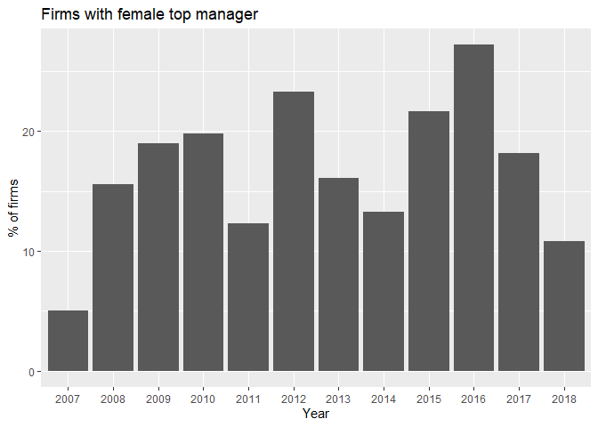
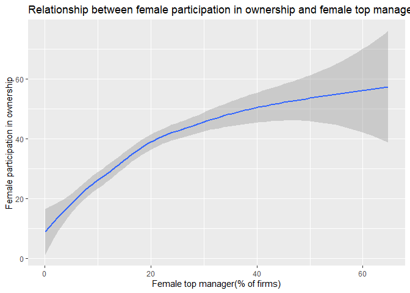
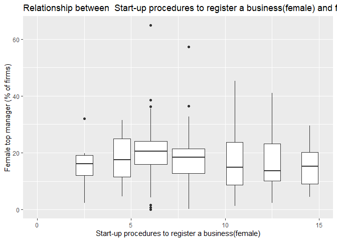
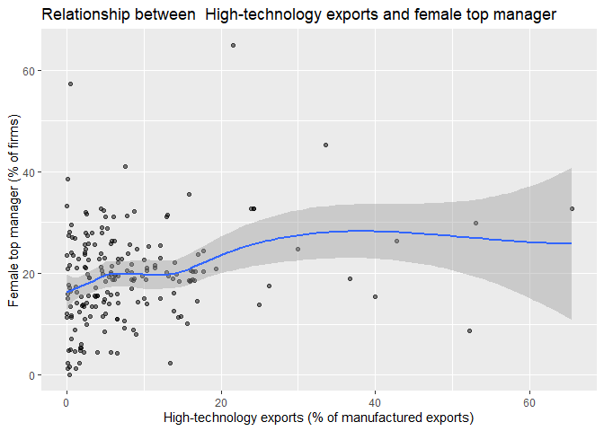

Exploring World Bank Data
================
Kejing Li

## Load necessary libraries

``` r
library(tidyverse)
```

    ## -- Attaching packages --------------------------------------- tidyverse 1.2.1 --

    ## v ggplot2 3.2.1     v purrr   0.3.2
    ## v tibble  2.1.3     v dplyr   0.8.3
    ## v tidyr   1.0.0     v stringr 1.4.0
    ## v readr   1.3.1     v forcats 0.4.0

    ## -- Conflicts ------------------------------------------ tidyverse_conflicts() --
    ## x dplyr::filter() masks stats::filter()
    ## x dplyr::lag()    masks stats::lag()

## Write a function to import the data files

``` r
read_and_tidy <- function(path) {
  data <- read.csv(path, skip = 4) %>%
  select(-Country.Code, -Indicator.Name)%>%
  filter(Indicator.Code %in% c("IC.FRM.FEMO.ZS",
                               "IC.FRM.FEMM.ZS",
                               "IC.REG.PROC.FE",
                               "TX.VAL.TECH.MF.ZS"))%>%
     
    pivot_longer(-c("Country.Name",
                    "Indicator.Code"),
                 names_to = "Year",
                 values_to = "Value",
                 names_prefix = "X") %>%
    pivot_wider(names_from = "Indicator.Code",
                values_from = "Value") %>%
    rename(hitech_export = TX.VAL.TECH.MF.ZS,
           female_register_procedure = IC.REG.PROC.FE,
           female_ownership_participation = IC.FRM.FEMO.ZS,
           female_top_management = IC.FRM.FEMM.ZS)
  return(data)     
}
```

## Import the data

``` r
directory <- dir(path = "data_world_bank", full.names = TRUE)
data <- data.frame()
for (i in seq_along(directory)){
  data <- bind_rows(data, read_and_tidy(directory[i]))
}
```

## Explore the data

### Firms with female participation in ownership by year

``` r
data %>%
  drop_na(female_ownership_participation)%>%
  ggplot()+
  geom_boxplot(aes(Year,female_ownership_participation))+
  labs(title = "Firms with female participation in ownership",
        x = "Year",
        y = "% of firms")
```

<!-- -->

### Firms with female top manager by year

``` r
data %>%
  drop_na(female_top_management)%>%
  group_by(Year) %>%
  summarize(female_top_management = mean(female_top_management)) %>%
  ggplot()+
  geom_col(aes(Year, female_top_management))+
  labs(title = "Firms with female top manager",
        x = "Year",
        y = "% of firms")
```

<!-- -->

### Covariance of female participation in ownership and female top manager

``` r
data%>%
  drop_na(female_ownership_participation, female_top_management) %>%
  group_by(Country.Name)%>%
  ggplot()+
  geom_smooth(aes(female_top_management,female_ownership_participation))+
labs(title = "Relationship between female participation in ownership and female top manager",
        x = "Female top manager",
        y = "Female participation in ownership")
```

    ## `geom_smooth()` using method = 'loess' and formula 'y ~ x'

<!-- -->

### Covariance of Start-up procedures to register a business(female) and female top manager

``` r
data%>%
  drop_na(female_register_procedure, female_top_management) %>%
  group_by(Country.Name)%>%
  ggplot()+
  scale_x_continuous(limits = c(0, 15))+
  geom_boxplot(aes(female_register_procedure, female_top_management,
                  group = cut_width(female_register_procedure, 2)))
```

    ## Warning: Removed 3 rows containing missing values (stat_boxplot).

<!-- -->

### Covariance of High-technology exports and female top manager

``` r
data%>%
  drop_na(hitech_export, female_top_management) %>%
  group_by(Country.Name)%>%
  ggplot(aes(hitech_export, female_top_management))+
  geom_point(alpha = 1/2)+
  geom_smooth()
```

    ## `geom_smooth()` using method = 'loess' and formula 'y ~ x'

<!-- -->

## Session info

``` r
devtools::session_info()
```

    ## - Session info ----------------------------------------------------------
    ##  setting  value                       
    ##  version  R version 3.6.1 (2019-07-05)
    ##  os       Windows 10 x64              
    ##  system   x86_64, mingw32             
    ##  ui       RTerm                       
    ##  language (EN)                        
    ##  collate  English_United States.1252  
    ##  ctype    English_United States.1252  
    ##  tz       America/Chicago             
    ##  date     2019-10-27                  
    ## 
    ## - Packages --------------------------------------------------------------
    ##  package     * version date       lib source        
    ##  assertthat    0.2.1   2019-03-21 [1] CRAN (R 3.6.1)
    ##  backports     1.1.5   2019-10-02 [1] CRAN (R 3.6.1)
    ##  broom         0.5.2   2019-04-07 [1] CRAN (R 3.6.1)
    ##  callr         3.3.2   2019-09-22 [1] CRAN (R 3.6.1)
    ##  cellranger    1.1.0   2016-07-27 [1] CRAN (R 3.6.1)
    ##  cli           1.1.0   2019-03-19 [1] CRAN (R 3.6.1)
    ##  colorspace    1.4-1   2019-03-18 [1] CRAN (R 3.6.1)
    ##  crayon        1.3.4   2017-09-16 [1] CRAN (R 3.6.1)
    ##  desc          1.2.0   2018-05-01 [1] CRAN (R 3.6.1)
    ##  devtools      2.2.1   2019-09-24 [1] CRAN (R 3.6.1)
    ##  digest        0.6.21  2019-09-20 [1] CRAN (R 3.6.1)
    ##  dplyr       * 0.8.3   2019-07-04 [1] CRAN (R 3.6.1)
    ##  ellipsis      0.3.0   2019-09-20 [1] CRAN (R 3.6.1)
    ##  evaluate      0.14    2019-05-28 [1] CRAN (R 3.6.1)
    ##  forcats     * 0.4.0   2019-02-17 [1] CRAN (R 3.6.1)
    ##  fs            1.3.1   2019-05-06 [1] CRAN (R 3.6.1)
    ##  generics      0.0.2   2018-11-29 [1] CRAN (R 3.6.1)
    ##  ggplot2     * 3.2.1   2019-08-10 [1] CRAN (R 3.6.1)
    ##  glue          1.3.1   2019-03-12 [1] CRAN (R 3.6.1)
    ##  gtable        0.3.0   2019-03-25 [1] CRAN (R 3.6.1)
    ##  haven         2.1.1   2019-07-04 [1] CRAN (R 3.6.1)
    ##  hms           0.5.1   2019-08-23 [1] CRAN (R 3.6.1)
    ##  htmltools     0.3.6   2017-04-28 [1] CRAN (R 3.6.1)
    ##  httr          1.4.1   2019-08-05 [1] CRAN (R 3.6.1)
    ##  jsonlite      1.6     2018-12-07 [1] CRAN (R 3.6.1)
    ##  knitr         1.25    2019-09-18 [1] CRAN (R 3.6.1)
    ##  labeling      0.3     2014-08-23 [1] CRAN (R 3.6.0)
    ##  lattice       0.20-38 2018-11-04 [1] CRAN (R 3.6.1)
    ##  lazyeval      0.2.2   2019-03-15 [1] CRAN (R 3.6.1)
    ##  lifecycle     0.1.0   2019-08-01 [1] CRAN (R 3.6.1)
    ##  lubridate     1.7.4   2018-04-11 [1] CRAN (R 3.6.1)
    ##  magrittr      1.5     2014-11-22 [1] CRAN (R 3.6.1)
    ##  memoise       1.1.0   2017-04-21 [1] CRAN (R 3.6.1)
    ##  modelr        0.1.5   2019-08-08 [1] CRAN (R 3.6.1)
    ##  munsell       0.5.0   2018-06-12 [1] CRAN (R 3.6.1)
    ##  nlme          3.1-140 2019-05-12 [1] CRAN (R 3.6.1)
    ##  pillar        1.4.2   2019-06-29 [1] CRAN (R 3.6.1)
    ##  pkgbuild      1.0.5   2019-08-26 [1] CRAN (R 3.6.1)
    ##  pkgconfig     2.0.3   2019-09-22 [1] CRAN (R 3.6.1)
    ##  pkgload       1.0.2   2018-10-29 [1] CRAN (R 3.6.1)
    ##  prettyunits   1.0.2   2015-07-13 [1] CRAN (R 3.6.1)
    ##  processx      3.4.1   2019-07-18 [1] CRAN (R 3.6.1)
    ##  ps            1.3.0   2018-12-21 [1] CRAN (R 3.6.1)
    ##  purrr       * 0.3.2   2019-03-15 [1] CRAN (R 3.6.1)
    ##  R6            2.4.0   2019-02-14 [1] CRAN (R 3.6.1)
    ##  Rcpp          1.0.2   2019-07-25 [1] CRAN (R 3.6.1)
    ##  readr       * 1.3.1   2018-12-21 [1] CRAN (R 3.6.1)
    ##  readxl        1.3.1   2019-03-13 [1] CRAN (R 3.6.1)
    ##  remotes       2.1.0   2019-06-24 [1] CRAN (R 3.6.1)
    ##  rlang         0.4.0   2019-06-25 [1] CRAN (R 3.6.1)
    ##  rmarkdown     1.16    2019-10-01 [1] CRAN (R 3.6.1)
    ##  rprojroot     1.3-2   2018-01-03 [1] CRAN (R 3.6.1)
    ##  rstudioapi    0.10    2019-03-19 [1] CRAN (R 3.6.1)
    ##  rvest         0.3.4   2019-05-15 [1] CRAN (R 3.6.1)
    ##  scales        1.0.0   2018-08-09 [1] CRAN (R 3.6.1)
    ##  sessioninfo   1.1.1   2018-11-05 [1] CRAN (R 3.6.1)
    ##  stringi       1.4.3   2019-03-12 [1] CRAN (R 3.6.0)
    ##  stringr     * 1.4.0   2019-02-10 [1] CRAN (R 3.6.1)
    ##  testthat      2.2.1   2019-07-25 [1] CRAN (R 3.6.1)
    ##  tibble      * 2.1.3   2019-06-06 [1] CRAN (R 3.6.1)
    ##  tidyr       * 1.0.0   2019-09-11 [1] CRAN (R 3.6.1)
    ##  tidyselect    0.2.5   2018-10-11 [1] CRAN (R 3.6.1)
    ##  tidyverse   * 1.2.1   2017-11-14 [1] CRAN (R 3.6.1)
    ##  usethis       1.5.1   2019-07-04 [1] CRAN (R 3.6.1)
    ##  vctrs         0.2.0   2019-07-05 [1] CRAN (R 3.6.1)
    ##  withr         2.1.2   2018-03-15 [1] CRAN (R 3.6.1)
    ##  xfun          0.10    2019-10-01 [1] CRAN (R 3.6.1)
    ##  xml2          1.2.2   2019-08-09 [1] CRAN (R 3.6.1)
    ##  yaml          2.2.0   2018-07-25 [1] CRAN (R 3.6.0)
    ##  zeallot       0.1.0   2018-01-28 [1] CRAN (R 3.6.1)
    ## 
    ## [1] D:/Tools/R-3.6.1/library
